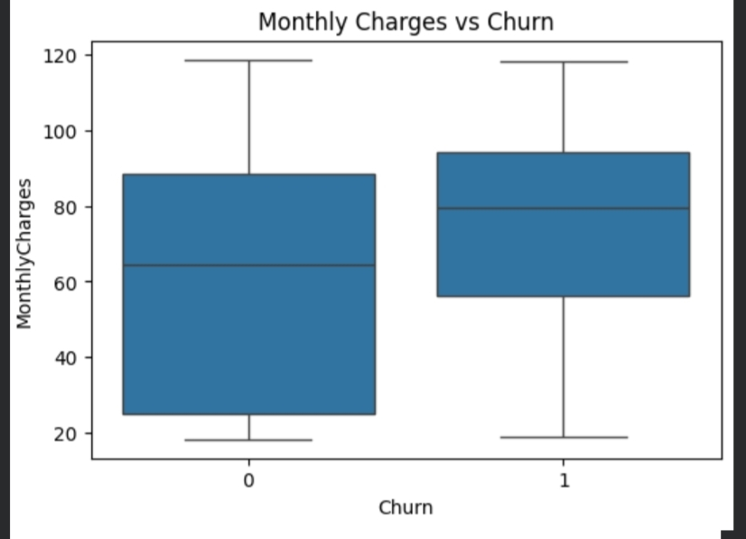
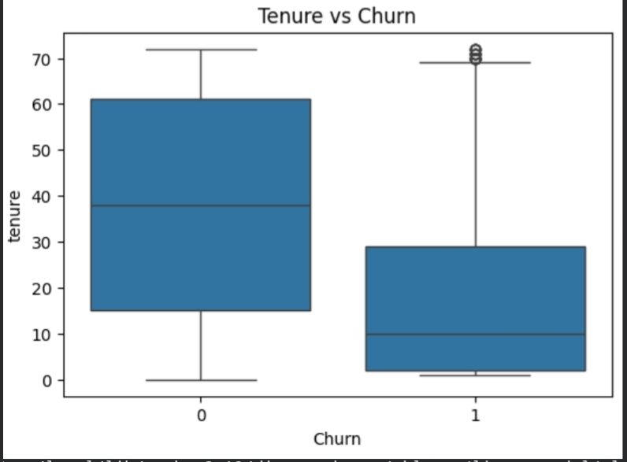

# Customer-Churn-Prediction-Business-Insights-Dashboard
## 📊 Key Visual Insights
This project explains customer churn in the simplest possible way: who leaves, when they leave, why they leave, and how to stop it

### 🔹 Churn vs Contract Type

**Insight:**  
بص على الأعمدة:
اللون الأزرق = ناس لسه مكملين
اللون البرتقالي = ناس مشيت
وفي 3 أنواع اشتراك:
شهر بشهر
سنة
سنتين
اللي حاصل:
في الشهر بشهر
في ناس كتير قوي لونها برتقالي → يعني بتمشي كتير
في السنة والسنتين
البرتقالي قليل جدًا → الناس بتكمل
ليه ده بيحصل؟
تخيل:
واحد يقدر يمشي في أي وقت → مش متعلق
واحد ماضي عقد سنة → متطمن ومكمل
الحل البسيط:
نخلي الناس تحب تمضي سنة أو سنتين
نديهم خصم أو ميزة
📌 الخلاصة 
اللي مش مربوط بعقد طويل، بيمشي أسرع
---

### 🔹 Monthly Charges vs Churn

**Insight:**  
الصورة بتقول إيه؟
دي بتقارن:
الناس اللي مشيت
الناس اللي مكملة على حسب:
بيدفعوا كام في الشهر؟
اللي واضح:
اللي مشوا
بيدفعوا فلوس أكتر
اللي مكملين
بيدفعوا أقل
ليه؟
تخيل:
بتدفع كتير
ومش حاسس بقيمة
هتقول: ليه أدفع كل ده؟ وتمشي
الحل:
مش نقلل السعر
نزود القيمة
(خدمات زيادة – دعم – باقة أحسن)
📌 الخلاصة:
السعر العالي من غير قيمة يطرد العميل

---

### 🔹 Tenure vs Churn

**Insight:**  
دي مقارنة بين:
ناس مكملة
ناس مشيت وهي بتقيس:
قعدوا قد إيه مع الشركة؟
اللي باين:
الناس اللي مكملة
أغلبهم قعد سنين
الناس اللي مشيت
أغلبهم قعد شهور قليلة
ليه؟
زي لعبة:
لو لعبت شوية ولسه ما حبتهاش → تسيبها
لو لعبت كتير → تتعلق
الحل:
نهتم بالعميل من أول يوم
نشرحله الخدمة
نكلمه ونطمن عليه
📌 الخلاصة:
أخطر وقت إن العميل يمشي هو أول سنة

These visualizations show that customer churn is not random.
It is strongly influenced by contract flexibility, early customer experience,
and perceived value for money.

Retention can be improved by:
- Encouraging long-term contracts
- Focusing on new customers onboarding
- Increasing value for high-paying customers
