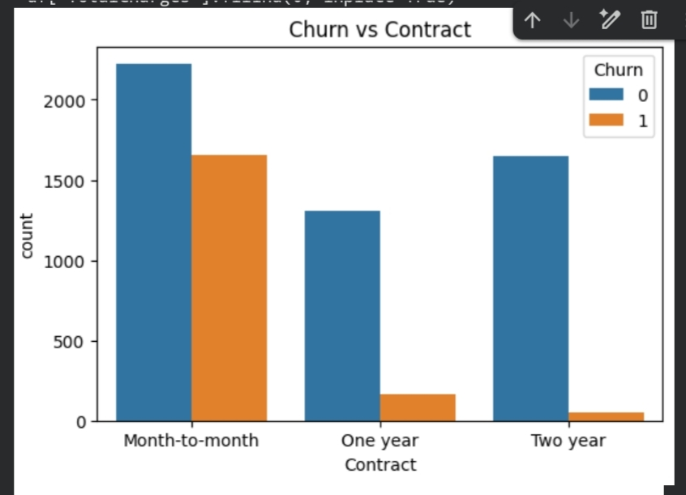

# Customer-Churn-Prediction-Business-Insights-Dashboard
## 📊 Key Visual Insights

### 🔹 Churn vs Contract Type

**Insight:**  
Month-to-month contracts have significantly higher churn rates compared to long-term contracts.

---

### 🔹 Monthly Charges vs Churn

**Insight:**  
Customers with higher monthly charges are more likely to churn, especially when value-added services are missing.

---

### 🔹 Tenure vs Churn

**Insight:**  
The first 12 months represent the highest churn risk period.
